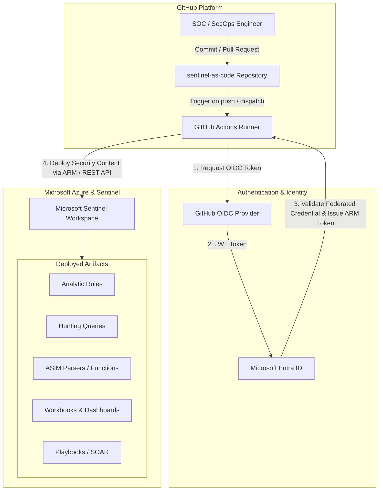

# Microsoft Sentinel-as-a-Code (CI/CD Pipeline)

[](https://azure.microsoft.com/services/microsoft-sentinel/)
[](https://github.com/features/actions)
[](https://learn.microsoft.com/azure/active-directory/develop/workload-identity-federation)
[](LICENSE)

Automated **Detection-as-Code** and Content Deployment pipeline for **Microsoft Sentinel** using **GitHub Actions** and **OIDC (Workload Identity Federation)**.

---

## 🎯 Project Overview

This repository implements a production-grade **Detection-as-Code** operating model for Microsoft Sentinel. Instead of manually authoring, tuning, and deploying detection rules directly in the Azure / Defender portal, all security content is treated as code:

- **Version Controlled:** Track rule versions, modifications, and tuning history with Git.
- **Peer-Reviewed & Governed:** Enforce review via Pull Requests before pushing detections to production.
- **Automated Deployment:** Continuous deployment to Microsoft Sentinel workspaces through GitHub Actions workflows.
- **Zero Secrets / Keyless Auth:** Authenticates directly to Microsoft Entra ID and Azure Resource Manager using OpenID Connect (OIDC) federated credentials—no expiring client secrets or certificates stored in GitHub.

---

## 🏗️ Architecture & Deployment Flow



---

## 📂 Repository Structure

```text
sentinel-as-code/
├── .github/
│   └── workflows/
│       └── sentinel-deploy.yml          # CI/CD deployment workflow
├── Detections/                          # Analytic Rules (KQL definitions)
│   ├── AzureActiveDirectory/            # Microsoft Entra ID detections (Identity & Access)
│   ├── Office365/                       # Exchange, Teams, SharePoint & OneDrive detections
│   ├── MicrosoftDefender/               # Defender XDR & Cloud alert integrations
│   ├── SecurityEvents/                  # Windows & Linux security event rules
│   └── AzureActivity/                   # Suspicious management & resource operations
├── Hunting Queries/                     # Proactive threat hunting KQL queries
├── Parsers/                             # ASIM Schema Parsers & KQL Workspace Functions
├── Workbooks/                           # Visual Dashboards & Security Monitoring (JSON)
└── Playbooks/                           # SOAR Automation Logic Apps (ARM / Bicep)
```

---

## 🚀 How It Works

1. **Detection Authoring:** Security engineers create or modify KQL Analytic Rules in YAML or JSON format under the `Detections/` folder.
2. **Validation:** GitHub Actions validates syntax, required fields, and rule configurations.
3. **Passwordless Authentication:** The workflow exchanges GitHub's OIDC token for an Azure Entra ID access token with scoped RBAC permissions.
4. **Idempotent Deployment:** Rules are published or updated in the target Microsoft Sentinel workspace (`sentinel-law`) without downtime or duplicates.

---

## 🔐 Authentication & Prerequisites

### 1. Azure RBAC Permissions
The App Registration configured for GitHub Actions requires:
- **Microsoft Sentinel Contributor** on the target Resource Group / Workspace.
- **Logic Apps Contributor** *(if deploying Playbooks)*.

### 2. Federated Identity Credential
Configured on the Microsoft Entra App Registration:
- **Issuer:** `https://token.actions.githubusercontent.com`
- **Subject:** `repo:<github-organization>/<repository-name>:ref:refs/heads/main`
- **Audience:** `api://AzureADTokenExchange`

### 3. GitHub Secrets
Configure the following secrets in **Settings > Secrets and variables > Actions**:

| Secret Name | Description |
| :--- | :--- |
| `AZURE_CLIENT_ID` | Application (Client) ID of the Entra App Registration |
| `AZURE_TENANT_ID` | Microsoft Entra Directory (Tenant) ID |
| `AZURE_SUBSCRIPTION_ID` | Azure Subscription ID hosting Sentinel |
| `AZURE_RESOURCE_GROUP` | Target Azure Resource Group name |
| `AZURE_WORKSPACE_NAME` | Target Microsoft Sentinel / Log Analytics Workspace name |

---

## 📖 Best Practices

- **Branch Protection:** Protect the `main` branch with mandatory Pull Request reviews.
- **Rule Tuning:** Always document suppression criteria, severity changes, and false-positive notes in commit messages and PR descriptions.
- **Testing:** Verify KQL query performance in Log Analytics before committing rules.
